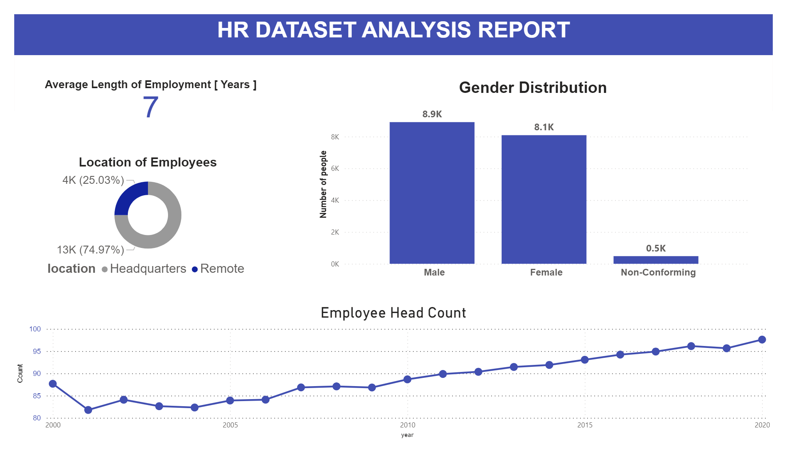

Data Cleaning & Analysis - MySQL Workbench

Data Visualization - PowerBI

---

What is the gender breakdown of employees in the company?

```
SELECT
gender, count(gender) as count
FROM hr_db.hr
WHERE termdate = "0000-00-00" AND age >= 18
GROUP BY gender;
```

---

what is the race/ethnicity breakdown in the company?

```
SELECT
race, count(race) as count
FROM hr_db.hr
WHERE termdate = "0000-00-00" AND age >= 18
GROUP BY race
ORDER BY count(race) DESC;
```

---

what is the age distribution of employees ?

- understand the stats

```
SELECT
MIN(age) AS min_age, MAX(age) AS max_age
FROM hr_db.hr
WHERE age >= 18 AND termdate = "0000-00-00";
```

- use the stats to create age groups

```
SELECT
CASE
WHEN age >=18 AND age <=24 THEN "18-24"
WHEN age >=25 AND age <=34 THEN "25-34"
WHEN age >=35 AND age <=44 THEN "35-44"
WHEN age >=45 AND age <=54 THEN "45-54"
WHEN age >=55 AND age <=64 THEN "55-64"
ELSE "65+"
END AS age_group,
COUNT(\*) AS count
FROM hr_db.hr
WHERE age >= 18 AND termdate = "0000-00-00"
GROUP BY age_group
ORDER BY age_group;
```

- add gender information as well

```
SELECT
CASE
WHEN age >=18 AND age <=24 THEN "18-24"
WHEN age >=25 AND age <=34 THEN "25-34"
WHEN age >=35 AND age <=44 THEN "35-44"
WHEN age >=45 AND age <=54 THEN "45-54"
WHEN age >=55 AND age <=64 THEN "55-64"
ELSE "65+"
END AS age_group,
gender,
COUNT(\*) AS count
FROM hr_db.hr
WHERE age >= 18 AND termdate = "0000-00-00"
GROUP BY age_group, gender
ORDER BY age_group, gender;
```

---

How many employees work at HQ vs REMOTE

```
SELECT
location, COUNT(location) AS count
FROM hr_db.hr
WHERE age >= 18 AND termdate = "0000-00-00"
GROUP BY location;
```

---

What is the average length of employment for employees who have been terminated

```
SELECT
hire_date, termdate, TIMESTAMPDIFF(YEAR, hire_date, termdate) AS diff
FROM hr_db.hr
WHERE age >= 18 AND termdate != "0000-00-00" AND termdate <= CURRENT_DATE();

SELECT
ROUND(AVG(TIMESTAMPDIFF(YEAR, hire_date, termdate)),2) AS avg_employment_length
FROM hr_db.hr
WHERE age >= 18 AND termdate != "0000-00-00" AND termdate <= CURRENT_DATE();
```

---

Gender Distribution across various department and job titles

```
SELECT
department, gender, count(gender) AS count
FROM hr_db.hr
WHERE age >= 18 AND termdate = "0000-00-00"
GROUP BY department, gender
ORDER BY department;
```

---

Distribution of job title across the company

```
SELECT
jobtitle, COUNT(jobtitle) AS COUNT
FROM hr_db.hr
WHERE age >= 18 and termdate = "0000-00-00"
GROUP BY jobtitle
ORDER BY jobtitle DESC;

SELECT
jobtitle, gender, COUNT(jobtitle) AS count
FROM hr_db.hr
WHERE age >= 18 AND termdate = "0000-00-00"
GROUP BY jobtitle, gender
ORDER BY jobtitle DESC;
```

---

Which department have the highest turnover rate?

Turnover rate is defined as the percentage of employees who have left a company
over a certain period of time.

What does a 20% turnover rate mean?
So if an organization has 50 employees at the beginning of the year and
ends the year with 100 employees,
the average number of employees for the year would be 75 (50+100=150, 150/2=75).
If 15 employees left the organization that year,
the turnover rate would be 20 percent (15/75 = 0.2, 0.2 x 100 = 20 percent).

```
WITH turnover AS (
SELECT
department,
COUNT(department) AS total_count,
SUM( CASE WHEN termdate != "0000-00-00" AND termdate < CURRENT_DATE() THEN 1 ELSE 0 END) AS term_count
FROM hr_db.hr
WHERE age >= 18
GROUP BY department
)

SELECT
\*, term_count / total_count AS term_rate
FROM turnover
ORDER BY term_rate DESC;
```

---

Distribution of employees across location [City / State]

```
SELECT
location_state, COUNT(location_state) AS count
FROM hr_db.hr
WHERE age >= 18 and termdate = "0000-00-00"
GROUP BY location_state
ORDER BY count DESC;
```

---

How has employee count changed over time based on hire & termination dates

```
WITH employment AS (
SELECT
YEAR(hire_date) AS year,
COUNT(\*) AS total_hire,
SUM( CASE WHEN termdate!="0000-00-00" AND termdate <= CURRENT_DATE() THEN 1 ELSE 0 END) AS total_term
FROM hr_db.hr
WHERE age >= 18
GROUP BY year
ORDER BY year
)

SELECT

- ,
  ROUND((total_term / total_hire) _ 100, 2) term_per,
  total_hire - total_term AS netchange,
  ROUND(((total_hire - total_term)/total_hire) _ 100 ,2) AS netchange_per
  FROM employment;
```

---

What is the tenure distribution for each department

```
SELECT
department,
ROUND(AVG(TIMESTAMPDIFF(YEAR, hire_date, termdate)),0) AS avg_tenure
FROM hr_db.hr
WHERE age >= 18 AND termdate !="0000-00-00" AND termdate <= CURRENT_DATE()
GROUP BY department
```

---
